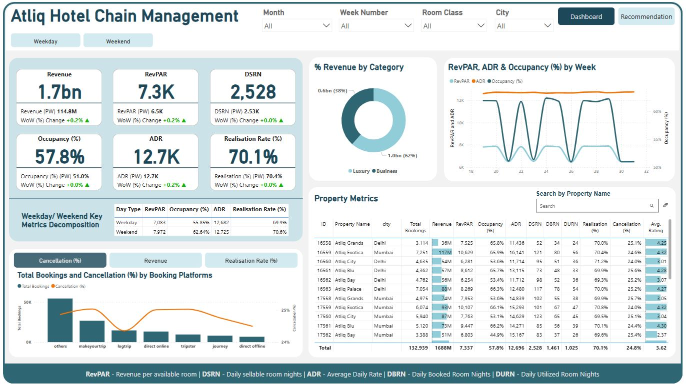
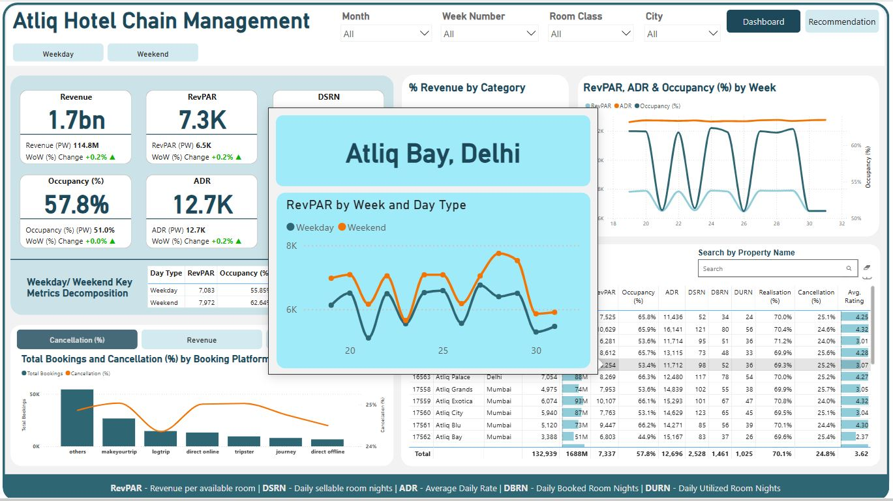
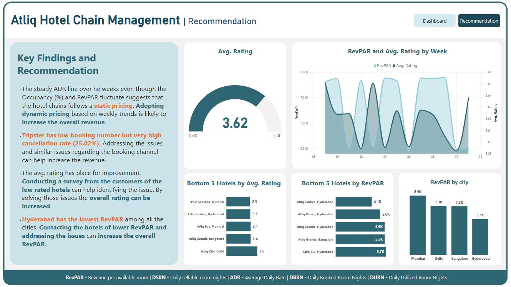

# 🏨 Atliq Hotel Chain Management - Power BI Dashboard

## 📌 Project Overview
This **Power BI Dashboard** provides a **comprehensive analysis of hotel performance metrics** for **Atliq Hotel Chain Management**. It enables **data-driven decision-making** by visualizing key insights such as **Revenue, Occupancy Rate, ADR, RevPAR, Booking Platform Performance, and Customer Ratings**.

This dashboard is built using **advanced Power BI functionalities**, including:
- **DAX Measures**
- **Conditional Formatting**
- **Tooltips**
- **Drillthrough**
- **Custom Visuals**

## 📊 Key Insights
### 1️⃣ **Revenue & Occupancy Trends**
   - The total revenue is **1.7bn**.
   - **Occupancy Rate:** 57.8%, with noticeable fluctuations across weekdays and weekends.
   - **ADR (Average Daily Rate):** 12.7K, but follows a static pricing strategy.

### 2️⃣ **Booking Platform Performance**
   - Major revenue sources include **MakeYourTrip (20%)** and other platforms.
   - **Tripster has a high cancellation rate of 25.02%**, indicating issues with that platform.

### 3️⃣ **Hotel Performance Metrics**
   - **Mumbai hotels have the highest RevPAR (8.9K), while Hyderabad hotels perform the worst (5.4K).**
   - **Low-rated hotels need customer feedback surveys** to improve service.

### 4️⃣ **Recommendations**
   - **Adopt dynamic pricing** instead of static pricing to optimize ADR & revenue.
   - **Address platform-specific booking issues** (e.g., Tripster) to reduce cancellations.
   - **Engage with low-rated hotels to enhance guest experiences** and increase RevPAR.

## 🔧 Power BI Features Used
This project leverages multiple **advanced Power BI functionalities**:
✅ **DAX Measures** for customized calculations  
✅ **Conditional Formatting** to highlight key metrics  
✅ **Tooltips & Drillthroughs** for deep data exploration  
✅ **Custom Visuals** to enhance data storytelling  

## 📷 Screenshots

### 🔹 Dashboard Overview

### 🔹 Tooltip & Drillthrough Example

### 🔹 Booking Platform Drillthrough

### 🔹 Recommendations & Insights

## 🚀 How to Use the Dashboard?
1️⃣ Open the **Power BI file (.pbix)**
2️⃣ Explore key metrics using **filters, slicers, and drillthroughs**
3️⃣ Use **tooltips** for in-depth insights on revenue, occupancy, and ratings
4️⃣ Analyze **recommendations** to enhance business performance

## 📌 Repository Contents
- `Atliq_Hotel_Management.pbix` - Power BI Dashboard File
- `README.md` - Project Documentation
- `Dashboard.JPG` - Main Dashboard Screenshot
- `Dashboard_with_tooltip.JPG` - Tooltip & Drillthrough Example
- `Platform_Drill_Through.JPG` - Booking Platform Analysis
- `Recommentdation.JPG` - Key Findings & Recommendations

## 📩 Contact & Connect
🔗 **LinkedIn:** [Tanvir Taushif](https://www.linkedin.com/in/tanvir-taushif-751044204/)
📧 **Email:** tanvirpial9961@gmail.com  

---

If you find this project useful, **⭐ Star this repository** and share your feedback! 🚀  

#PowerBI #DataAnalytics #BusinessIntelligence #HotelManagement #DAX #DashboardDesign
